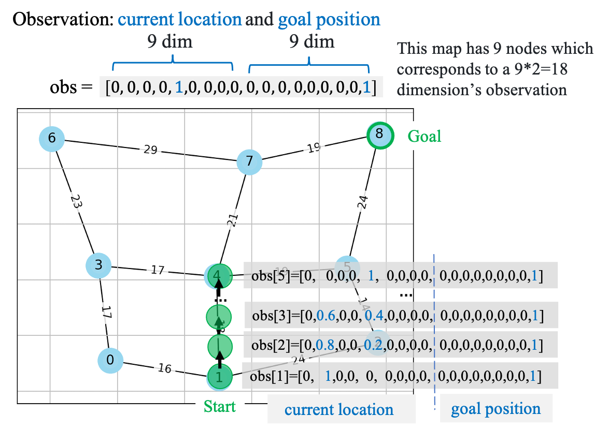
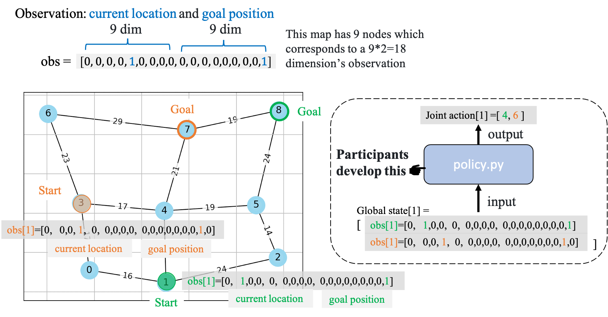
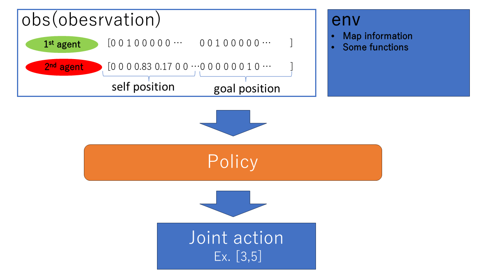
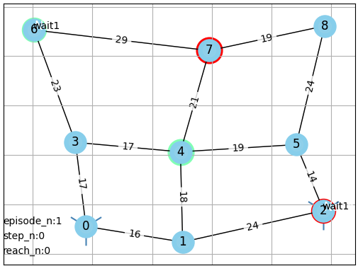
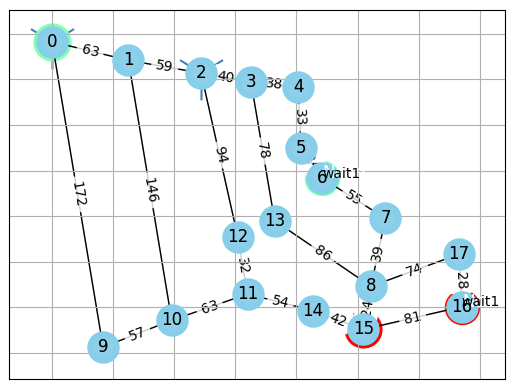
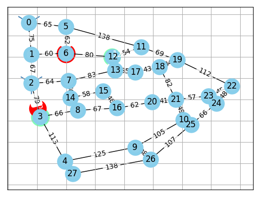
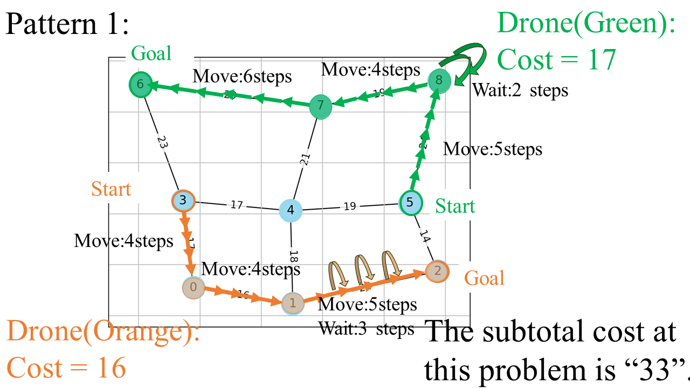
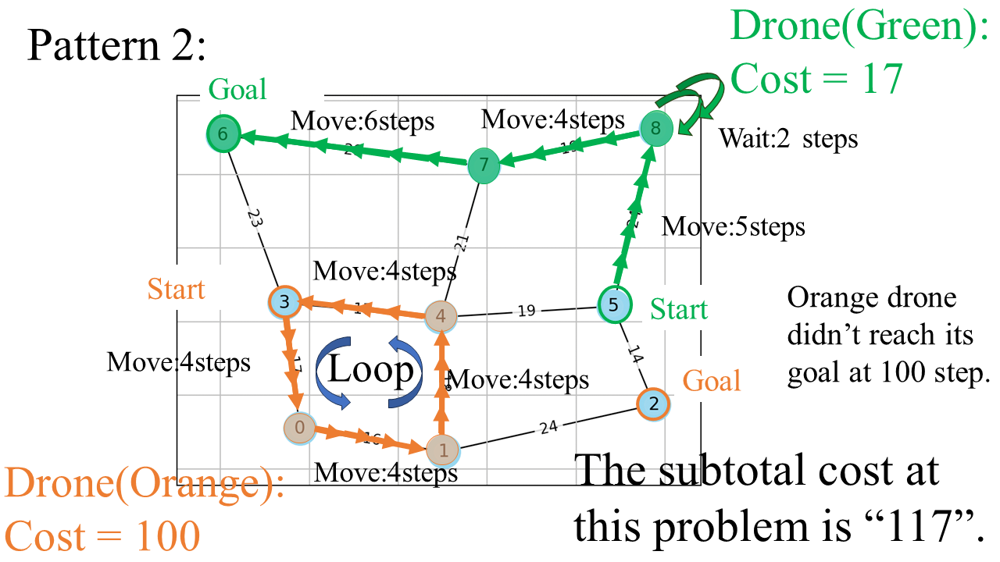
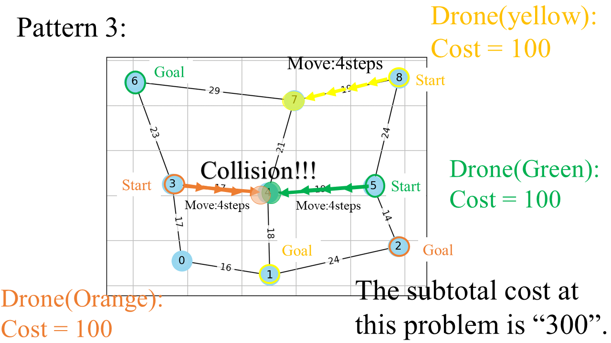

<link href="assets\css\markdown.css"></link>

# Codes of [DRP Challenge](https://drp-challenge.com/#/overview)

> [!Note]
>
> ### News
>
> 2024.05.09 DRP Challenge at AAMAS2024 was successfully held. Thank you to all participants!
>
> 2024.04.25 We extended the Submission Deadline to April 28th, 23:59 AoE. We are looking forward to your submission!!
>
> 2024.03.22 [Some date](https://drp-challenge.com/#/guidelines#important-date) has been changed and [Frequently Asked Questions](assets/markdown/FAQ.md) page open.
>
> 2024.03.14 A reinforcement learning [example code](example/) has been provided.
>
> 2024.03.10 A brief illustration [video](https://youtu.be/GvozDxtEDTs) has been uploaded.

## Outline

- [Installation](#installation)
- [Development](#development)
- [Evaluation](#evaluation)
- [Appendix](#appendix)

## Click [here!](https://youtu.be/GvozDxtEDTs) for introduction video.

## Installation

This environment works in `python==3.11.4`.(For more details, please refer to [this Q&A](https://github.com/DrpChallenge/main/blob/main/assets/markdown/FAQ.md#installation) )
We recommend you create an exclusive environment like

```
conda create -n drpdev python=3.11.4
conda activate drpdev
```

before executing the following code.

```
git clone https://github.com/DrpChallenge/main.git
pip3 install -e ./main
pip3 install -r ./main/requirements.txt
```

Then it will show the following GUI if you run `policy_tester.py`.


Success :tada::tada: Let's start to develop algorithms for DRP challenge!

<a id="development"></a>

## Development

<!-- #### ``policy/policy.py`` -->

In this competition, participants are expected to develop `policy/policy.py`, which is essentially a mapping from input(`observation`) to output (`joint action`) at each step.

- `observation (obs)`: The obs $s^i$ for each drone consists of two parts: `current location` and `goal position`. They are in soft-hot representation: the length of this vector $s^i=\left[s_1^i, \ldots, s_j^i, \ldots s_{|V|}^i, s_{|V|+1}^i, \ldots, s_{|V|+j}^i, \ldots s_{|V|*2}^i\right]$ equates to the double of number $|V|$ of the nodes on a map.

  - It marks a node $s_j^i$ with 1 if the drone occupies it, while the rest remain zero.
  - For drones located on the edges, vector values are defined by: $s_j^i=1-\frac{len\left(l o c^i-v_j^i\right)}{len\left(v_j, v_k\right)}, s_k^i=1-s_j^i$ when drone $i$ traverses edge $\left(v_j, v_k\right)$, and 0 otherwise. Here, $loc^i=\left(l^{x^i}, l^{y^i}\right)$ represents drone $i$ 's current coordinates and len(,) represents the distance. As drone i approaches node $v_j^i$, the value of $s_j^i$ increases.
  - Also, it has Field of View information, which marks a node $s_j^i$ in onehot with -1 if another drone occupies it.
  <p align="center">
   
    
  </p>

- `joint action`: At each step, drones can choose a node to move. Consequently, we represent the action set $A$ using the node set $V$. It will wait at the current node if a drone choose an non-adjacent nodes. The joint action includes all individual actions from all drones.
<!--
<p align="center">
 
</p>
-->

#### Step and Episode

Every time each drone takes action, increases step count.
In other words, every time the `step` function is excused, the number of steps increases by one.

The episode ends upon conflict, exceeding 100 steps, or all drones reaching goals and restarting with a new environment ( If not specified indications, only the positions of the start and goal change.).

#### Goal for Contribution

The goal for contribution in this competition is to minimize [cost](#cost) without collision happens.
You can test your developed (`policy/policy.py`) by loading it in `policy_tester.py`.

> [!NOTE]
> Since drp is a gym-standard environment, you can develop it as an usual gym-standard environment without relying on `policy_tester.py` we provided. There is an [example code](example/) by using [pfrl](https://github.com/pfnet/pfrl).

<a id="evaluation"></a>

## Evaluation

We use three maps for evaluations: `map_3x3`, `map_aoba01`, `map_shibuya`.

<p align="center">
  
  
  
</p>

Each map will be evaluated on various drone numbers and various start-goal pairs.
We call one pattern (fixed map, number of drones, and start-goal pair) as a problem and there are a totally of 30 problems which are defined in `problem/problems.py`. (Participants are forbidden to alter this file.)

<a id="cost"></a>

#### Cost for each problem 　

$$
cost_p = \frac{1}{10} \sum_{i=1}^{10} \sum_{j \in drones} cost_{ij}
$$

Where:
$i$ is the iteration number. For each problem, we take average of 10 iterations as the final result.
$drones$ is the set of drones at that problem.

$$
cost_{ij} = \begin{cases}
step_{ij} & \text{if drone $j$ reached its goal without collision at iteration $i$, $cost_{ij}$ is the steps costed until reaching its goal } \\
100 & \text{if collision happened or drone $j$ doesn't reach the goal } \\
\end{cases}
$$

There are three classic patterns to calculate costs as follows.

<p align="center">



</p>

#### Final cost of all problems

$$
Final~Cost = \sum_{p \in problems}cost_p
$$

where:
$cost_p$ is the cost of the problem $p$.

The final cost is the sum of the costs of the 30 problems ([more details](https://github.com/DrpChallenge/main/blob/main/problem/problems.py)). The objective is to **minimize** this final cost $Final~Cost$.

Once your (`policy/policy.py`) has been deployed, you can run `calculate_cost.py`, which will outputs a json file (`your_team_name.json`) including the cost (named `final cost`).

<a id ="appendix"></a>

## Appendix

Please refer to [this page](assets/markdown/appendix.md) to get more detailed information about the DRP environment.

## [FAQ](assets/markdown/FAQ.md)
